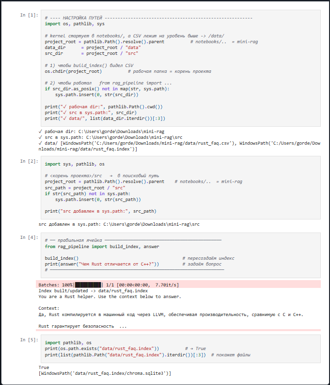

#  Mini-RAG (offline demo)

Мини-репо, показывающее, как собрать Retrieval-Augmented-Generation **без** внешних сервисов

 **Работает целиком офлайн** | Достаточно `git clone` и Python — демо запускается без интернета и тарифов на API

 **Сразу видно цену запросов** | При наличии ключа каждый вызов модели пишет в лог число токенов и итоговую стоимость — легко следить за расходами 

 **Есть автотесты** | Десять проверок по BERTScore страхуют: любое изменение кода не ухудшит ответы 

 **Легко сменить тематику** | Подменяем CSV, запускаем `build_index()` — и RAG отвечает уже по новой базе знаний 

 **Живой пример в ноутбуке** | `notebooks/demo_offline.ipynb` открывается прямо на GitHub, видно вопрос и готовый ответ, ничего запускать не нужно 

 **Готово к CI** | `requirements.txt`, editable-install и тесты позволяют подключить GitHub Actions за пару минут 


## Установка
```bash
git clone https://github.com/<user>/mini-rag.git
cd mini-rag
python -m venv venv && . venv/Scripts/activate      # Win
pip install -r requirements.txt
pytest -q      # 10 тестов на BERTScore (офлайн)
```

